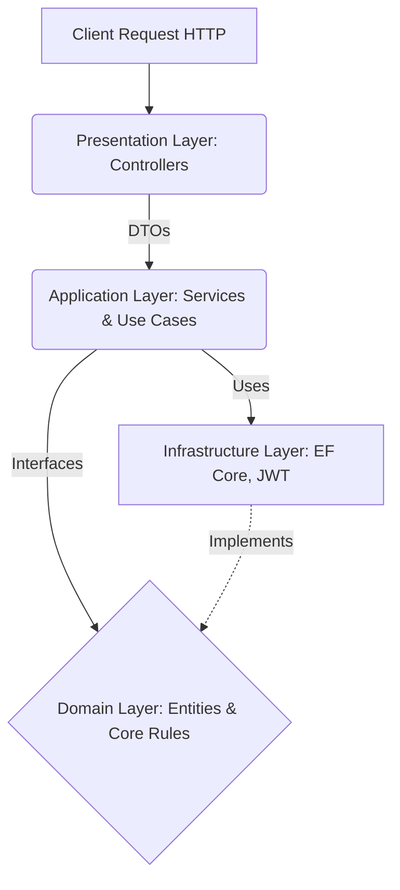
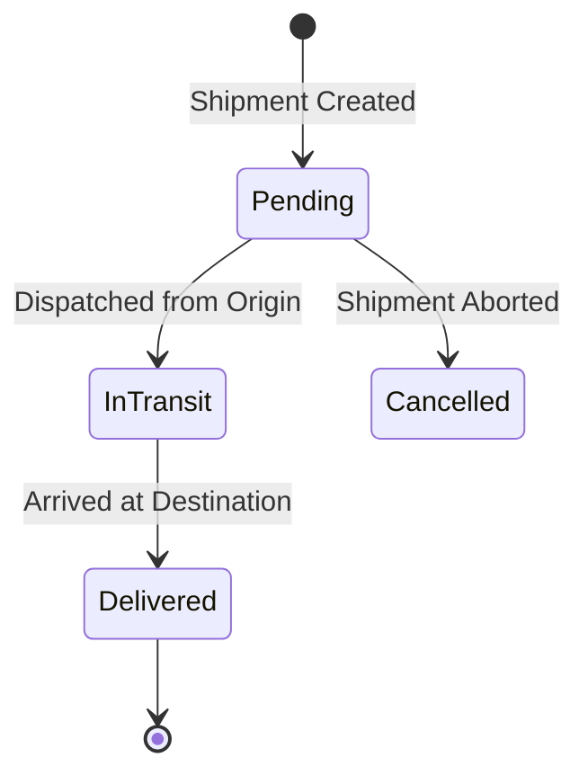

***

```markdown
# Logistics Management System API

## Overview
The Logistics Management System API is a robust, enterprise-grade RESTful backend service built with **ASP.NET Core 8**. It is engineered to orchestrate and streamline the core operations of a large-scale shipping and logistics company. The system provides secure, high-performance endpoints for managing the complete lifecycle of shipments, fleet assignment, warehouse capacities, and payment processing.

Designed with maintainability and scalability in mind, this project serves as a comprehensive implementation of modern software engineering principles and design patterns.

## System Architecture

This project strictly adheres to **Clean Architecture** (Onion Architecture) principles, ensuring a complete decoupling of the core business logic from external frameworks, databases, and delivery mechanisms.

### Dependency Flow Diagram
*The following diagram illustrates the request lifecycle and layer dependencies. (Renders natively in GitHub)*



* **Domain Layer:** The core of the system. Contains Entities, Enums, and Repository Interfaces. It has zero external dependencies.
* **Application Layer:** Contains the business logic, Services, DTOs, AutoMapper profiles, and FluentValidation rules. It depends only on the Domain layer.
* **Infrastructure Layer:** Handles external concerns such as Data Access (Entity Framework Core), implementations of the Unit of Work and Repositories, and JWT Token generation.
* **Presentation Layer (API):** Consists of thin controllers that route HTTP requests to the Application layer and format standard HTTP responses.

## Technical Stack & Design Patterns

* **Framework:** .NET 8 / C#
* **Database:** SQL Server via Entity Framework Core (Code-First)
* **Design Patterns:**
  * **Generic Repository Pattern:** Abstracts data access logic and reduces code duplication.
  * **Unit of Work (UoW):** Ensures transactional integrity when business transactions span multiple repositories.
  * **Dependency Injection (DI):** Facilitates loose coupling and testability across all layers.
* **Libraries:**
  * **AutoMapper:** For seamless object-to-object mapping (Entities ↔ DTOs).
  * **FluentValidation:** Enforces strict, rule-based data validation independently of the domain models.
  * **BCrypt.Net-Next:** For cryptographic password hashing.

## Core Business Modules & Process Flow

### 1. Shipment Lifecycle Management
Manages the end-to-end journey of a package. The system enforces strict business rules, such as verifying warehouse capacities and ensuring shipment weights do not exceed assigned vehicle limits.



### 2. Fleet & Personnel Operations
* **Driver & Vehicle Mapping:** Ensures one-to-one operational assignments (a vehicle can only have one assigned driver concurrently).
* **Role Management:** Hierarchical employee structuring.

### 3. Payment Processing
* Secure transaction logging.
* Enforces idempotent payment rules (prevents duplicate payments for the same shipment ID).

## Security & Authorization

The API implements stateless security using **JSON Web Tokens (JWT)** combined with strict **Role-Based Access Control (RBAC)**.

* **Admin:** Full system access, including employee management and role assignments.
* **Manager:** Operational oversight, authorized to create shipments and assign fleet resources.
* **Employee:** Restricted operational access, limited to updating shipment statuses and processing daily warehouse tasks.

## Cross-Cutting Concerns

### Global Exception Handling
To prevent the leakage of sensitive stack traces and ensure consistent client consumption, a custom **Middleware** intercepts all unhandled exceptions and Business Rule Violations, formatting them into standardized HTTP responses:

```json
{
  "status": 400,
  "message": "Shipment weight exceeds vehicle capacity."
}
```

### Structured Logging
Critical state mutations are recorded using `.NET ILogger`. The system actively traces:
* Shipment instantiation and status transitions.
* Payment completions.
* Fleet assignment operations.

## Getting Started

### Prerequisites
* .NET 8.0 SDK
* SQL Server

### Installation & Execution

1. **Clone the repository:**
   ```bash
   git clone [https://github.com/your-username/LogisticsManagementSystem.git](https://github.com/your-username/LogisticsManagementSystem.git)
   cd LogisticsManagementSystem
   ```

2. **Database Configuration:**
   Update the `DefaultConnection` string in `Logistics.API/appsettings.json` with your SQL Server credentials.

3. **Security Configuration:**
   Modify the `JwtSettings:Key` in `appsettings.json` to a robust, secure cryptographic key.

4. **Apply Migrations & Update Database:**
   ```bash
   dotnet ef database update --project Logistics.Infrastructure --startup-project Logistics.API
   ```

5. **Run the Application:**
   ```bash
   dotnet run --project Logistics.API
   ```
   *Swagger UI will be accessible at `https://localhost:<port>/swagger`.*

## API Testing (Authentication)
1. Seed or create an Employee record via the database.
2. Authenticate via `POST /api/auth/login` using the employee's Email and Password.
3. Extract the `Token` from the response payload.
4. In the Swagger UI, click **Authorize** and input: `Bearer <your_jwt_token>`.
```
