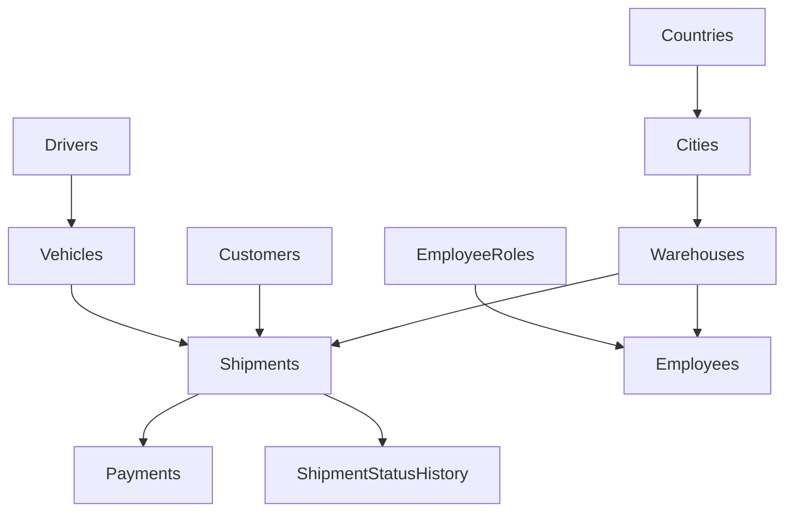
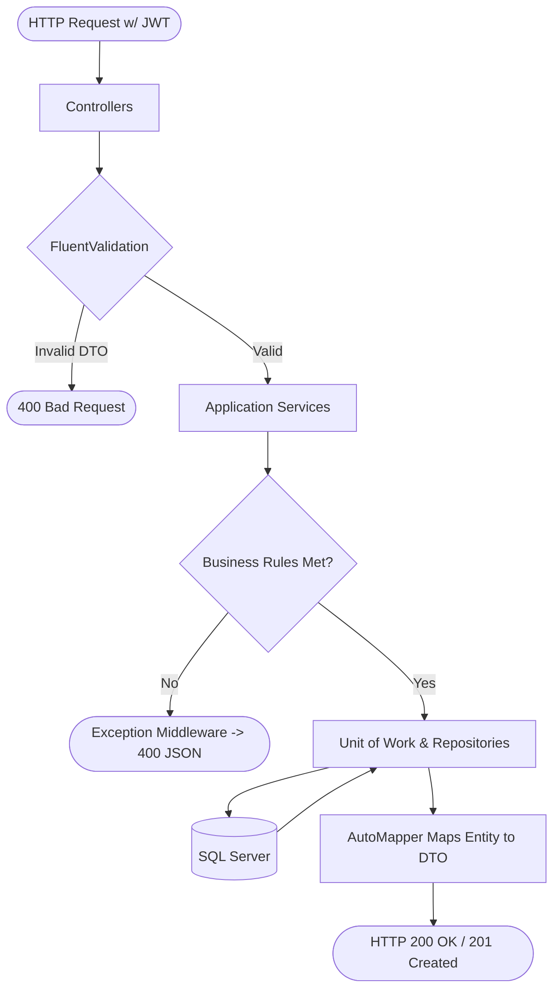
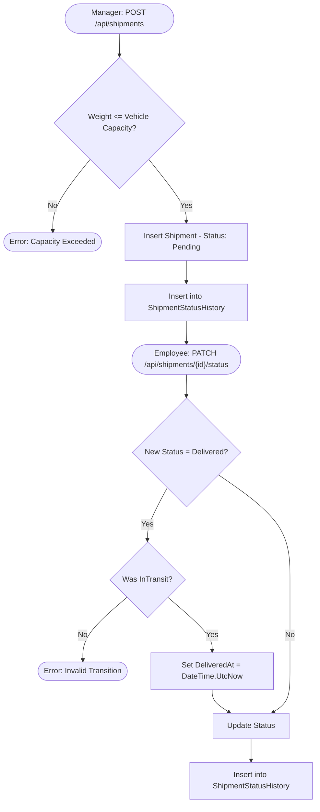

# 🚚 Logistics Management System API

A production-level RESTful backend service for a shipping and logistics company. Covers advanced ASP.NET Core concepts including:
**Clean Architecture, Unit of Work, Generic Repositories, JWT Authentication, Fluent Validation, AutoMapper, and Global Error Handling.**

---

## 📁 Repository Structure (Clean Architecture)

```text
LogisticsSolution/
├── Logistics.Domain/         # Core Entities, Enums, and Repository Interfaces
├── Logistics.Application/    # Business Logic (Services), DTOs, Mappings, Validations
├── Logistics.Infrastructure/ # EF Core DbContext, UoW Implementation, JWT Provider
├── Logistics.API/            # Controllers, Global Middlewares, Dependency Injection
└── README.md
```

---

## 🗂️ Entity Relationship Overview



---

## 🔄 API Request & Architecture Workflow



---

## 📦 Shipment Lifecycle & Business Flow



---

## ⚙️ Core Modules & Business Rules Summary

| Module | Core Endpoints | Business Rules Enforced in Services |
|---|---|---|
| **Shipments** | `POST`, `GET`, `PATCH /status` | Weight cannot exceed vehicle capacity. Cannot mark `Delivered` unless previously `InTransit`. |
| **ShipmentStatusHistory** | `GET /shipments/{id}/status-history` | Read-only. Automatically records every status change with a timestamp. |
| **Vehicles** | `POST`, `GET`, `POST /assign-driver` | Plate number must be unique. A vehicle can only have one assigned driver. |
| **Drivers** | `POST`, `GET`, `PUT`, `DELETE` | Standard CRUD. Managed for fleet assignments. |
| **Payments** | `POST`, `GET`, `PATCH /pay` | A shipment cannot be paid for twice. |
| **Customers** | `POST`, `GET`, `PATCH /deactivate` | Email and Phone number must be unique across the system. |
| **Warehouses** | `POST`, `GET`, `PUT`, `DELETE` | Capacity must be greater than 0. |
| **Countries** | `POST`, `GET`, `PUT`, `DELETE` | Country name must be unique system-wide. |
| **Cities** | `POST`, `GET`, `PUT`, `DELETE` | City name must be unique within its respective Country. |
| **Employees** | `POST`, `GET`, `PUT`, `DELETE` | Passwords are automatically hashed using BCrypt. Strictly managed by `Admin` role. |
| **Roles** | `POST`, `GET` | Defines RBAC system roles (e.g., Admin, Manager, Employee). |

---

---

## 🔒 Security & RBAC (Role-Based Access Control)

The API is secured using **JWT (JSON Web Tokens)** with encrypted passwords via `BCrypt.Net-Next`.

| Role | Access Level & Controller Permissions |
|---|---|
| `Admin` | Full System Access. The only role authorized to manage `EmployeesController`. |
| `Manager` | Operational Control. Authorized to create Shipments and assign Fleet resources. |
| `Employee` | Task Execution. Authorized to update Shipment statuses and process operations. |

*(All secure endpoints require the `Authorization: Bearer <Token>` header).*

---

## 🛡️ Global Error Handling

A custom Middleware intercepts all application exceptions to prevent stack trace leaks and standardize client responses.

**Example Response for Business Rule Violation:**
```json
{
  "status": 400,
  "message": "Shipment weight exceeds vehicle capacity."
}
```

---

## 🛠️ Technologies & Patterns Used

- **Framework:** .NET 8 / ASP.NET Core Web API
- **Database:** Entity Framework Core (SQL Server)
- **Architecture:** Clean Architecture (Onion)
- **Design Patterns:** Generic Repository, Unit of Work, Dependency Injection (DI)
- **Object Mapping:** AutoMapper
- **Validation:** FluentValidation
- **Security:** JWT Bearer Authentication, BCrypt Password Hashing
- **Documentation:** Swagger / OpenAPI (Configured for JWT Auth)
- **Logging:** built-in `.NET ILogger` for critical business transactions.
